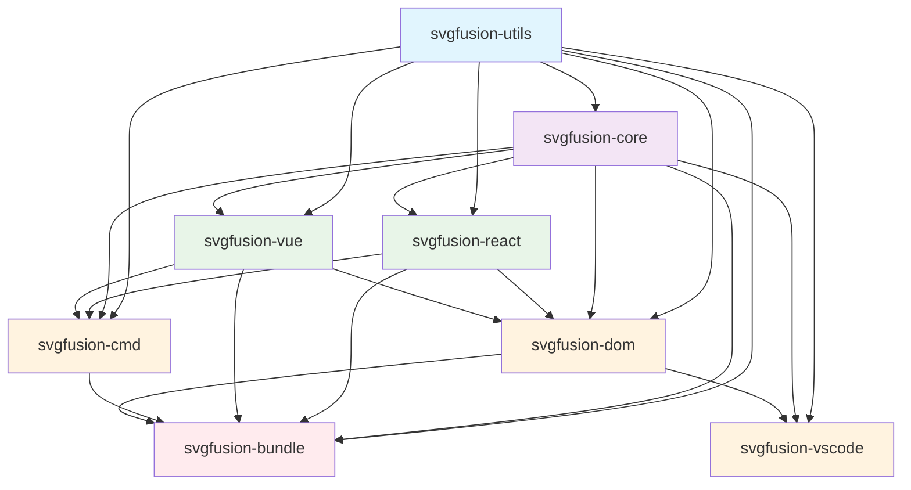
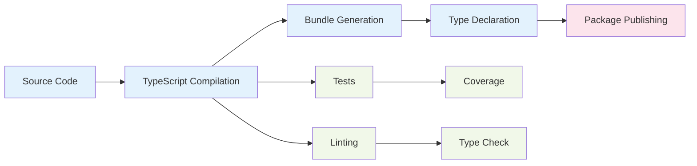

# SVGFusion Architecture & Dependency Graph

## Overview

SVGFusion is a comprehensive monorepo that converts SVG files into React and Vue components with automatic color extraction, TypeScript support, and seamless integration across multiple platforms. The architecture follows a clean layered design with clear separation of concerns.

## Package Architecture

### Core Architecture Layers

### Layer Descriptions

1. **Foundation Layer** (`svgfusion-utils`)
   - Shared utilities and common functionality
   - No internal dependencies
   - Provides base services for all other packages

2. **Core Layer** (`svgfusion-core`)
   - Main conversion engine and transformation logic
   - Depends only on utils
   - Framework-agnostic SVG processing

3. **Generator Layer** (`svgfusion-react`, `svgfusion-vue`)
   - Framework-specific component generators
   - Depend on core and utils
   - Pluggable architecture for new frameworks

4. **Interface Layer** (`svgfusion-cmd`, `svgfusion-dom`, `svgfusion-vscode`)
   - User-facing interfaces and tools
   - Leverage generators and core functionality
   - Platform-specific implementations

5. **Bundle Layer** (`svgfusion-bundle`)
   - Main distribution package
   - Aggregates all functionality
   - Primary entry point for end users

## Package Details

### svgfusion-bundle (Main Package)

**Published as**: `svgfusion`  
**Purpose**: Main entry point that bundles all functionality

**Key Features**:

- Unified API for all frameworks
- CLI interface
- Browser compatibility
- Convenience functions for React and Vue conversion

**Dependencies**:

- All internal packages via workspace references
- External: `chalk`, `commander`, `jsdom`, `zod`, `figlet`

### svgfusion-core

**Purpose**: Core conversion engine and transformation logic

**Key Components**:

- `SVGFusion`: Main engine class
- `SVGParser`: Parses SVG content and extracts metadata
- `SVGTransformer`: Applies transformations and optimizations
- `ComponentGenerator`: Base class for framework generators

**Features**:

- Color extraction and manipulation
- Stroke width splitting
- Accessibility enhancements
- SVG optimization
- Framework-agnostic processing

**Dependencies**:

- `svgfusion-utils` (workspace)
- External: `colord`, `jsdom`, `zod`

### svgfusion-utils

**Purpose**: Shared utilities for all packages

**Key Components**:

- String manipulation (`pascalCase`, `camelCase`, `toReactProp`)
- File operations (`readSvgFile`, `writeComponentFile`, `ensureDir`)
- Color extraction and manipulation
- Name formatting and validation
- CLI utilities (colors, banners)
- Duplicate name validation

**Dependencies**:

- External only: `chalk`, `commander`, `figlet`, `colord`

### svgfusion-react

**Purpose**: React component generator

**Key Features**:

- TypeScript component generation
- Props interface generation
- Accessibility attributes
- Color prop extraction
- React-specific optimizations

**Dependencies**:

- `svgfusion-core`, `svgfusion-utils` (workspace)
- External: `@types/react`

### svgfusion-vue

**Purpose**: Vue 3 component generator

**Key Features**:

- Vue 3 SFC generation
- TypeScript support
- Props definition
- Composition API
- Vue-specific optimizations

**Dependencies**:

- `svgfusion-core`, `svgfusion-utils` (workspace)
- External: `vue`

### svgfusion-cmd

**Purpose**: Standalone CLI interface

**Key Features**:

- Batch conversion
- Watch mode
- Configuration files
- Progress reporting
- Framework selection

**Dependencies**:

- `svgfusion-core`, `svgfusion-react`, `svgfusion-vue`, `svgfusion-utils` (workspace)

### svgfusion-dom

**Purpose**: Browser-optimized package

**Key Features**:

- Browser-compatible API
- Returns component strings
- Client-side validation
- No file system operations
- Framework detection

**Dependencies**:

- `svgfusion-core`, `svgfusion-react`, `svgfusion-vue`, `svgfusion-utils` (workspace)

### svgfusion-vscode

**Purpose**: Visual Studio Code extension

**Key Features**:

- Context menu integration
- Batch conversion
- Interactive playground
- Live preview
- Workspace detection

**Dependencies**:

- `svgfusion-core`, `svgfusion-dom`, `svgfusion-utils` (workspace)
- External: `@types/vscode`, `@vscode/vsce`

## Dependency Flow

### External Dependencies by Category

**Core Functionality**:

- `jsdom`: DOM manipulation and SVG parsing
- `colord`: Advanced color manipulation
- `zod`: Runtime type validation

**CLI & User Interface**:

- `chalk`: Terminal colors
- `commander`: CLI argument parsing
- `figlet`: ASCII art banners

**Development**:

- `typescript`: TypeScript compilation
- `tsup`: Build tooling
- `jest`: Testing framework
- `eslint`: Code linting
- `semantic-release`: Automated releases

**Framework Specific**:

- `@types/react`: React type definitions
- `vue`: Vue framework
- `@types/vscode`: VS Code extension types

### Build & Release Process

## Key Design Principles

### 1. **Modular Architecture**

- Each package serves a specific purpose
- Clear interfaces between packages
- Tree-shakable for optimal bundle sizes

### 2. **Framework Agnostic Core**

- Core engine doesn't depend on any UI framework
- Framework-specific logic isolated in generator packages
- Easy to add support for new frameworks

### 3. **Multi-Platform Support**

- Node.js for CLI and build tools
- Browser for client-side processing
- VS Code for development integration

### 4. **Type Safety**

- Full TypeScript support across all packages
- Runtime validation with Zod
- Comprehensive type definitions

### 5. **Developer Experience**

- Rich CLI with progress indicators and colors
- VS Code integration for seamless workflow
- Interactive playground for testing
- Comprehensive documentation

## Workspace Configuration

### PNPM Workspace Strategy

- Uses `workspace:*` for internal dependencies during development
- Converts to specific versions during publishing
- Enables fast development with immediate change propagation
- Maintains clean published packages

### Build Order

1. `svgfusion-utils` (foundation)
2. `svgfusion-core` (depends on utils)
3. `svgfusion-react`, `svgfusion-vue` (depend on core + utils)
4. `svgfusion-cmd`, `svgfusion-dom` (depend on generators)
5. `svgfusion-vscode` (depends on dom + utils)
6. `svgfusion-bundle` (depends on all)

## Performance Considerations

### Bundle Optimization

- Tree-shaking support for unused code elimination
- Separate browser builds without Node.js dependencies
- Modular imports to reduce bundle size

### Processing Performance

- Streaming SVG processing for large files
- Batch operations for multiple files
- Caching for repeated conversions
- Optimized DOM operations

## Security Considerations

### Input Validation

- SVG content sanitization
- Path traversal prevention
- File type validation
- Size limits for uploads

### Build Security

- Dependency vulnerability scanning
- Automated security updates
- No dynamic code execution
- Sandboxed processing

## Future Architecture Considerations

### Extensibility

- Plugin system for custom transformations
- Custom framework generator registration
- Configurable processing pipelines
- Theme and preset systems

### Scalability

- Worker thread support for CPU-intensive operations
- Streaming processing for large files
- Distributed processing capabilities
- Cloud integration options

---

_This architecture document reflects the current state of SVGFusion and will be updated as the system evolves._
